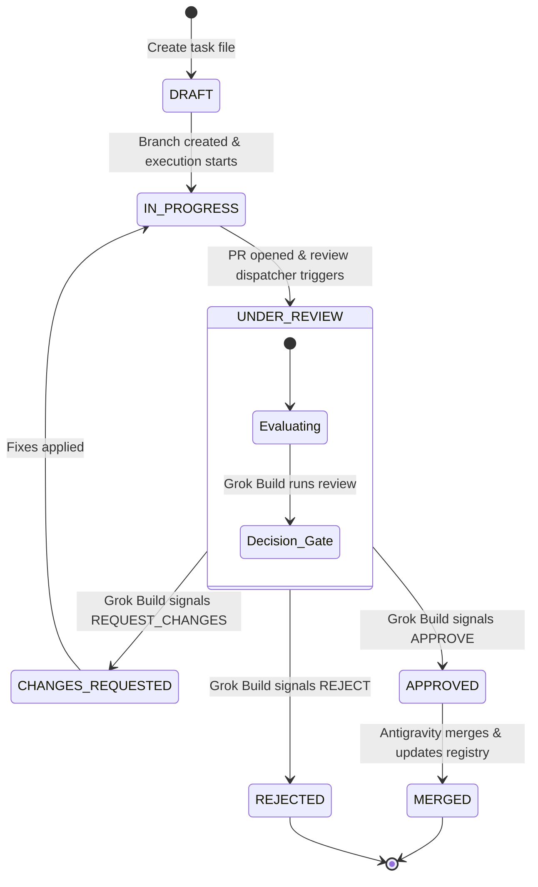

# Agent State and Architecture Definition

This document outlines the system architecture, agent roles, state machine, failure-handling mechanics, and autonomy loop for the three-agent autonomous system in this repository.

---

## 1. System Architecture & Gate Control

The development loop separates the **logical planning**, **code execution**, and **review authority**:
- **Layer 1 (Codex)**: Planner who defines specifications, writes task files, and manages the registry.
- **Layer 2 (Grok Build)**: Logical gatekeeper who reviews code changes and writes reviews.
- **Layer 3 (Antigravity)**: Executor who modifies code, creates PRs, and merges them once approved.
- **Enforcement Layer (GitHub)**: Automatically blocks merging via branch protection settings until status checks (Grok Build's review approval check) pass.

---

## 2. Central State Registry (Single Source of Truth)

To prevent state drift between different folders and GitHub PR statuses, this registry is the **single source of truth** for all tasks.

| Task ID | State | Linked PR / Branch | Last Updated |
| :--- | :--- | :--- | :--- |

---

## 3. Normalized Task Lifecycle States

Each task must progress strictly through the following state machine:

### State Transitions

| State | Target State | Triggering Event | Description / Action |
| :--- | :--- | :--- | :--- |
| **`DRAFT`** | `IN_PROGRESS` | Planner or watcher releases task for execution | Task is ready for Antigravity. Only this transition should trigger executor handoff. |
| **`IN_PROGRESS`** | `UNDER_REVIEW` | Executor finishes implementation | Antigravity marks the task ready for Grok Build review. |
| **`UNDER_REVIEW`** | `CHANGES_REQUESTED` | Grok Build outputs `REQUEST_CHANGES` | Feedback is written to `REVIEWS/review_NNN.md` and check fails. |
| **`CHANGES_REQUESTED`** | `IN_PROGRESS` | Antigravity resumes editing | Changes are made on the branch. |
| **`UNDER_REVIEW`** | `APPROVED` | Grok Build outputs `APPROVE` | Review check passes, unlocking the physical merge gate on GitHub. |
| **`APPROVED`** | `MERGED` | Antigravity merges branch | PR is merged to `main`/`master`, change is logged, and registry is updated. |
| **`UNDER_REVIEW`** | `REJECTED` | Grok Build outputs `REJECT` | PR is closed without merging; task marked dead. |

---

## 4. Autonomy Loop & Event Dispatching

1. **Tasking**: Codex (Planner) adds a task in state `DRAFT` to the registry and writes the task specification. `DRAFT` is planning-only and must not trigger Antigravity.
2. **Execution Dispatch**: When the planner or watcher is ready to hand the task to Antigravity, the task moves to `IN_PROGRESS`. The watcher only dispatches executor work on `IN_PROGRESS`, not on `DRAFT`.
3. **Coding**: Antigravity (Executor) edits the code on the task branch. When implementation and self-checks are complete, Antigravity must move both `TASKS/task_NNN.md` and `AGENT_STATE.md` to `UNDER_REVIEW`. It must not use `COMPLETED`.
4. **Review Dispatching**: The watcher sees `AGENT_STATE.md` transition to `UNDER_REVIEW`, generates the review request/diff payload, and dispatches Grok Build.
5. **Signaling**: Grok Build outputs its review report (`REVIEWS/review_NNN.md`) to the branch.
6. **Reconciliation**:
   - If the signal is `APPROVE`, the branch status check turns green, and Antigravity merges the PR.
   - If the signal is `REQUEST_CHANGES`, the status check remains red, and the task transitions to `CHANGES_REQUESTED` (and subsequently back to `IN_PROGRESS` once modification begins).
   - If `REJECT`, the PR is aborted and marked `REJECTED`.

---

## 5. Exception & Failure Handling

- **Review Deadlock**: If a PR is rejected or changes requested three (3) consecutive times, the loop halts, transitions the task to `REJECTED`, and alerts the operator.
- **Stalled Approved State**: If a PR remains `APPROVED` but unmerged for more than 24 hours, the loop halts to investigate git/auth conflicts.
- **Rule Violations**: If a commit bypasses the dispatcher or review gates, the validation Action fails, blocking the merge, and triggering an alert.
