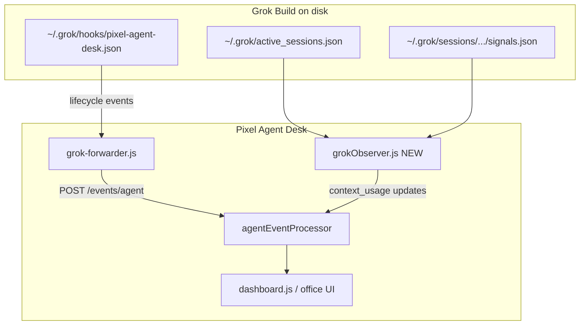

# Grok Build Context Usage (Plan A+C) — PR Scope for 小A

Date: 2026-06-23  
Owner: 小A  
Reviewer: Kevin / PAD maintainers

---

## 1. Goal

讓 **Grok Build** 在 PAD 裡顯示 **上下文壓力（CTX%）**，用戶 **下載 PAD → 打開 → 正常使用 Grok**，無需手動設定。

| 用戶看到 | 來源 |
|----------|------|
| 辦公室小人、狀態、tool | 既有 hook forwarder（不變） |
| **CTX ~16%**（context window 使用率） | 新增 `signals.json` observer |
| Model 名稱（如 `grok-composer-2.5-fast`） | `signals.json` / `summary.json` |
| Tokens / Cost 在 Usage 頁 | **不顯示**（`Usage unavailable`，不捏造 0） |

**一句話**：Grok 走 **Context-only** 路線，不走 Claude 式 **Metered**（input/output/$）累加。

---

## 2. Non-Goals

- 不把 `contextTokensUsed` 塞進 `token_usage.input_tokens` 做 session 累加（snapshot ≠ delta，會 double-count）。
- 不為 Grok 估算 `estimatedCost`（訂閱/credits 模式，定價表也不含 `grok-composer-*`）。
- 不改 Grok Build 本體 hook payload（方案 B 留給後續 Grok 團隊）。
- 不把 Grok 納入 Dashboard Usage 頁的 **Total Indexed Tokens / Lifetime Spend** 加總。
- 不處理 Antigravity 的 context（本 PR 僅 `grok-build`）。

---

## 3. User Experience Contract

### 3.1 無腦使用條件（實作完成後）

1. 用戶已安裝 Grok Build（`~/.grok` 存在或首次由 PAD 建立 hooks 目錄）。
2. **PAD 應用程式在運行**（observer 跑在 PAD 進程內）。
3. 用戶開 **新的** Grok session（或 reload hooks：`Ctrl+L` → Hooks → `r`）。

### 3.2 用戶不需要做的事

- 編輯 `~/.grok/config.toml`
- 手動寫 hook JSON
- 在 PAD 設定裡勾選開關
- `npm install` forwarder（PAD 啟動時 `materializeAssets` 已處理）

### 3.3 已知邊界（文件化即可，不必本 PR 全解）

| 情境 | 預期 |
|------|------|
| PAD 關閉 | 小人可能靠最後狀態殘留，CTX% 停止更新 |
| `GROK_HOME` 自訂路徑 | Observer 應讀 `process.env.GROK_HOME \|\| ~/.grok`（見 §5.2） |
| 僅 Cursor 內建 Grok、從未裝 standalone | 若 Cursor 不載入 `~/.grok/hooks/`，小人可能不出現（hook 問題，非 observer） |

---

## 4. Architecture



**雙通道**：

- **Hook 通道**（已有）：`agent.started` / `agent.working` / `agent.thinking` …
- **Observer 通道**（新增）：週期性讀 `signals.json`，emit `agent.thinking` 或內部 `context.update` 語義的 normalized event，只更新 `contextUsage`，不碰 state。

---

## 5. Data Contract (Plan C)

### 5.1 新欄位：`context_usage`

在 normalized agent event 上新增（與 `token_usage` 並列，互斥語義）：

```js
context_usage: {
  kind: 'snapshot',           // 固定值；未來若有 hook 推送可擴展
  tokens_used: 32927,         // 對應 signals.contextTokensUsed
  window_tokens: 200000,      // 對應 signals.contextWindowTokens
  percent: 16,                // 對應 signals.contextWindowUsage（優先使用，避免重算誤差）
  total_before_compaction: 0  // 可選；signals.totalTokensBeforeCompaction
}
```

**禁止**：在 Grok observer 事件上帶 `token_usage` 或 `metadata.raw_token_usage`。

### 5.2 Agent 物件落地欄位

`AgentManager` / `agentEventProcessor` 寫入 agent：

```js
contextUsage: {
  kind: 'snapshot',
  tokensUsed: 32927,
  windowTokens: 200000,
  percent: 16,
  totalBeforeCompaction: 0,
  available: true,            // Grok 有讀到 signals 即 true
},
tokenUsage: {
  inputTokens: 0,
  outputTokens: 0,
  estimatedCost: 0,
  usageAvailable: false,      // 明確標記非 metered
  contextPercent: 16,         // 向後相容：現有 UI 讀這個顯示 CTX%
},
model: 'grok-composer-2.5-fast',  // 從 signals.primaryModelId 或 summary.current_model_id
```

**規則**：

- `context_usage` → 只更新 `contextUsage` + `tokenUsage.contextPercent` + `model`。
- **不**呼叫 `computeTokenUsage()` / `computeSnapshotDelta()`（避免誤當 billing delta）。
- `usageAvailable` 保持 `false`；`hasMeteredUsage()` 必須回 false。

### 5.3 Schema 更新

`src/main/agentEventSchema.js` 新增：

```js
context_usage: {
  type: 'object',
  properties: {
    kind: { type: 'string', enum: ['snapshot'] },
    tokens_used: { type: 'number' },
    window_tokens: { type: 'number' },
    percent: { type: 'number' },
    total_before_compaction: { type: 'number' }
  },
  additionalProperties: false
}
```

`token_usage` 定義不變（給 Claude / OpenCode 用）。

---

## 6. PR Breakdown

建議 **單一 PR**（改動耦合度高）；若必須拆分，按下列順序 stack：

| 順序 | 範圍 | 可獨立驗收 |
|------|------|------------|
| PR-1 | `grokObserver` + `grokObserverAdapter` + unit tests | `jest` 綠燈 |
| PR-2 | `grokIntegration.start/stop` + `integrationManager` wiring | dev `npm start` observer active |
| PR-3 | `agentEventProcessor` + schema + processor tests | pipe event → agent 有 CTX% |
| PR-4 | `dashboardAdapter` + `dashboard.js` UI 分流 | UI 目視 |
| PR-5 | Packaged DMG smoke + `integration-smoke-test.md` 更新 | §9 gate |

**本文件假設一個 PR 交付全部**，commit 可按上表分 commit message。

---

## 7. File-by-File Implementation Checklist

### 7.1 新增：`src/main/grokObserver.js`

參考 `src/main/codexObserver.js` 模式（polling、fail-open、不寫入 `~/.grok`）。

| 項目 | 規格 |
|------|------|
| 建構 | `createGrokObserver({ homeDir, grokHome, processAgentEvent, debugLog, pollIntervalMs })` |
| `grokHome` | `process.env.GROK_HOME \|\| path.join(homeDir, '.grok')` |
| 掃描來源 1 | `path.join(grokHome, 'active_sessions.json')` — 取得活躍 `session_id` + `cwd` |
| 掃描來源 2 | `path.join(grokHome, 'sessions')` 下依 `session_id` 找目錄（需處理 URL-encoded cwd 分組） |
| 讀取檔案 | `<sessionDir>/signals.json`（必須）；可選讀 `summary.json` 補 `current_model_id` |
| 輪詢間隔 | 預設 `3000ms`（可調；比 Codex 2s 略慢即可） |
| 去重 | 每 `session_id` 記錄上次 `percent` + `tokens_used`；僅在變化時 emit |
| 事件類型 | `event: 'agent.thinking'`（agent 已存在時）或允許 processor 新增輕量 handler `handleContextUsage` |
| payload | `{ agent_id, source: 'grok-build', context_usage: {...}, model, timestamp }` |
| 健康 | `getHealth()` → `{ active, lastEventAt, error }` |
| 停止 | `stop()` 清 timer |

**Session 目錄解析**（關鍵）：

```
~/.grok/sessions/<url-encoded-cwd>/<session-id>/signals.json
```

實作策略：

1. 從 `active_sessions.json` 拿 `session_id` + `cwd`。
2. `encodedCwd = encodeURIComponent(cwd)` 或與 Grok 一致的編碼（對照本機 `~/.grok/sessions/` 目錄名；必要時 fallback glob `**/sessionId/signals.json`）。
3. 寫單元測試覆蓋「encoded path」與「glob fallback」。

### 7.2 新增：`src/main/adapters/grokObserverAdapter.js`

純函式，無 I/O：

```js
parseActiveSessions(jsonString) → Map<sessionId, { cwd, pid, opened_at }>
parseSignals(jsonString) → context_usage object | null
mapSignalsToContextEvent(sessionId, signals, summary, projectPath) → normalized event | null
resolveSessionDir(grokHome, sessionId, cwd) → string | null
```

### 7.3 修改：`src/main/integrations/grokIntegration.js`

| 函式 | 變更 |
|------|------|
| `createGrokIntegration` | 接受 `processAgentEvent`（與 codex 一致） |
| `start()` | 若 `!detectInstalled()` → `{ status: 'skipped' }`；否則 `createGrokObserver(...).start()` |
| `stop()` | 停止 observer |
| `getHealth()` | 委派 observer `getHealth()` |
| `setupMode` | 改為 `'command-hook+observer'` 或保留 `command-hook` 並在 label 註明（擇一，更新 tests） |

`integrationManager.registerDefaultAdapters` 傳入 `processAgentEvent`：

```js
createGrokIntegration({
  debugLog: log,
  forwarderPath: opts.forwarderPath || null,
  homeDir: opts.homeDir || undefined,
  processAgentEvent: opts.processAgentEvent || null,
})
```

### 7.4 修改：`src/main/agentEventProcessor.js`

新增 `handleContextUsage(data)` 或在 `handleAgentThinking` 開頭分支：

```js
if (data.context_usage?.kind === 'snapshot') {
  // 只更新 contextUsage + tokenUsage.contextPercent + model
  // 不呼叫 computeTokenUsage / computeSnapshotDelta
  return;
}
```

**所有 state handler**（`working` / `thinking` / `idle`）應在更新其他欄位時 **保留** 既有 `contextUsage`（merge，不覆蓋為 null）。

`agent.removed` 時清除該 agent 的 context 快取（若 observer 有 module-level map，在 observer 內清）。

### 7.5 修改：`src/main/agentEventSchema.js`

見 §5.3。

### 7.6 修改：`src/agentManager.js`

`mergeAgent` / 預設值加入 `contextUsage: null`（或 `{ available: false }`）。

### 7.7 修改：`src/dashboardAdapter.js`

```js
function hasContextUsage(agent) {
  return !!(agent.contextUsage?.available || agent.tokenUsage?.contextPercent != null && !hasMeteredUsage(agent));
}

// adaptAgentToDashboard 輸出：
contextUsage: pixelAgent.contextUsage || null,
usageAvailable: hasMeteredUsage(...),  // Grok 為 false
contextAvailable: hasContextUsage(...), // Grok 為 true
```

### 7.8 修改：`public/dashboard.js`

更新 `hasMeteredUsage` 與 popover / mission control 卡片：

| 欄位 | Metered agent | Grok (context-only) |
|------|---------------|---------------------|
| Tokens | `12.4K` | `—` 或 `N/A` |
| Cost | `$0.0042` | `N/A` |
| Context | `~35%` | `~16%`（有值時顯示，色條沿用 `ctx-high/mid/low`） |

**CTX 色條應在 `contextAvailable === true` 時顯示**，不再要求 `isMetered`。

Mission Control popover（約 L437）：

```js
const ctxValText = (ag.contextAvailable || isMetered) && ctxPct != null ? `~${ctxPct}%` : '-';
const tokensVal = isMetered ? formatNum(...) : '—';
```

### 7.9 修改：`src/main/integrations/integrationManager.js`

`registerDefaultAdapters` 已傳 `processAgentEvent`；確認 grok adapter 收到即可（§7.3）。

### 7.10 測試檔案

| 檔案 | 內容 |
|------|------|
| `__tests__/grokObserverAdapter.test.js` | **新增** — parse signals、map event、resolve session dir |
| `__tests__/grokObserver.test.js` | **新增** — temp `~/.grok` 目錄結構，poll emit、去重、stop |
| `__tests__/grokIntegration.test.js` | **更新** — `start()` 不再 skipped；mock `processAgentEvent` |
| `__tests__/agentEventProcessor.test.js` | **新增** — `context_usage` 不增加 `inputTokens`；`usageAvailable` 仍 false |
| `__tests__/dashboardAdapter.test.js` | **新增** — grok agent `contextAvailable: true`, `usageAvailable: false` |
| `__tests__/integrationManager.test.js` | 確認 capability report `grok-build active: true`（observer 啟動後） |

Fixtures 範例 `__tests__/fixtures/grok/signals.json`：

```json
{
  "contextWindowUsage": 16,
  "contextTokensUsed": 32927,
  "contextWindowTokens": 200000,
  "totalTokensBeforeCompaction": 0,
  "turnCount": 1,
  "primaryModelId": "grok-composer-2.5-fast"
}
```

### 7.11 文件

| 檔案 | 變更 |
|------|------|
| `docs/integration-smoke-test.md` | §5.3 Grok 增加 CTX% 驗收步驟；§7 增加 observer 驗證 |
| `docs/global-agent-office-plan.md` | §11 / §14 Grok feasibility 從 Unknown → Context-only（可選，1 段即可） |
| `README.md` | Token 章節加一句 Grok 僅顯示 context % |

---

## 8. Normalized Event Example

Observer emit（不經 forwarder）：

```json
{
  "event": "agent.thinking",
  "agent_id": "019ef284-490c-7562-9629-82a0e4d77134",
  "source": "grok-build",
  "project_path": "/path/to/pixel-agent-desk",
  "model": "grok-composer-2.5-fast",
  "timestamp": 1782185400000,
  "context_usage": {
    "kind": "snapshot",
    "tokens_used": 32927,
    "window_tokens": 200000,
    "percent": 16,
    "total_before_compaction": 0
  }
}
```

---

## 9. Packaged DMG Smoke Gate（必做）

沿用 `docs/integration-smoke-test.md` §7，**在本 PR 合併前**於 macOS 跑完整流程。

### 9.1 Build

```bash
npm test
npm run dist:mac
```

### 9.2 前置

1. 關閉所有 dev 版 PAD（`npm start` / `electron .`）。
2. 只開 `release/mac/Pixel Agent Desk.app`（或 arm64 目錄對應 .app）。

### 9.3 Hook 路徑檢查

```bash
cat ~/.grok/hooks/pixel-agent-desk.json
```

必須含：

- `ELECTRON_RUN_AS_NODE=1`
- `~/.pixel-agent-desk/runtime/forwarders/grok-forwarder.js`
- **不得**出現 repo 內 `src/forwarders/` 絕對路徑

### 9.4 Forwarder pipe test（小人出現）

```bash
echo '{"hookEventName":"SessionStart","sessionId":"packaged-smoke-grok-ctx","workspaceRoot":"/tmp/packaged-test"}' \
  | ELECTRON_RUN_AS_NODE=1 "./release/mac/Pixel Agent Desk.app/Contents/MacOS/Pixel Agent Desk" \
    "$HOME/.pixel-agent-desk/runtime/forwarders/grok-forwarder.js" SessionStart
```

- Exit code `0`
- PAD `debug.log` 出現 `[Processor] ← agent.started agent=packaged`

### 9.5 Observer / CTX% test（本 PR 新增）

1. 在 `/tmp/packaged-test` 開 Grok Build session（或手動佈置 fixture）：

```bash
GROK_HOME="$HOME/.grok"  # 或 temp 目錄做隔離測試
mkdir -p "$GROK_HOME/sessions/%2Ftmp%2Fpackaged-test/packaged-smoke-grok-ctx"
cat > "$GROK_HOME/sessions/%2Ftmp%2Fpackaged-test/packaged-smoke-grok-ctx/signals.json" <<'EOF'
{"contextWindowUsage":42,"contextTokensUsed":84000,"contextWindowTokens":200000,"totalTokensBeforeCompaction":0,"primaryModelId":"grok-composer-2.5-fast"}
EOF
echo '[{"session_id":"packaged-smoke-grok-ctx","pid":99999,"cwd":"/tmp/packaged-test","opened_at":"2026-06-23T00:00:00Z"}]' > "$GROK_HOME/active_sessions.json"
```

2. 重啟 packaged PAD，等待 ≥1 個 poll 週期（~3s）。
3. 打開 Dashboard / Office，找到 `packaged-smoke-grok-ctx`：
   - **Context** 顯示 `~42%`
   - **Tokens** 顯示 `—` / `Usage unavailable`，**不是** `84000` 或 `0`
4. `GET http://127.0.0.1:47821/api/agents`（或 dashboard API）檢查 JSON：

```json
"contextUsage": { "available": true, "percent": 42, ... },
"usageAvailable": false,
"tokenUsage": { "inputTokens": 0, "outputTokens": 0, "usageAvailable": false, "contextPercent": 42 }
```

### 9.6 Capability report

PAD 啟動 log 應含：

```
grok-build: installed=true integrated=true active=true setupMode=...
```

（`active=true` 代表 observer 已啟動。）

### 9.7 回歸

- Claude / OpenCode agent 的 metered token 顯示不受影響。
- `npm test` 全綠。

---

## 10. Acceptance Criteria（Definition of Done）

- [ ] `grokIntegration.start()` 啟動 observer；`stop()` 可停止；`getHealth().active === true`
- [ ] 讀取 `signals.json` 正確映射 `context_usage`，**不**寫入 `token_usage`
- [ ] `agentEventProcessor` 對 Grok **不累加** `inputTokens` / `outputTokens` / `estimatedCost`
- [ ] Dashboard / Mission Control：Grok 顯示 CTX%，Tokens/Cost 為 unavailable
- [ ] Usage 頁總計 **不包含** Grok session
- [ ] 新開 Grok session + PAD 開著 → **無手動設定** 即可看到 CTX% 更新
- [ ] Packaged DMG §9 全部通過
- [ ] `jest` 全綠；新增測試覆蓋 adapter + processor + dashboardAdapter
- [ ] 不破壞既有 `grok-forwarder` / hook registration 行為

---

## 11. Implementation Notes for 小A

1. **先抄 Codex observer 骨架**，再縮小範圍（只讀 `signals.json`，不 tail jsonl）。
2. **Session 路徑編碼**是最容易踩坑的點；用本機 `~/.grok/sessions/` 真實目錄名寫測試 fixture，不要猜。
3. Observer emit `agent.thinking` 時，若 agent 尚未被 hook 建立，可 **skip**（等 SessionStart hook）；不要 auto-create 新 agent（避免與 hook 語義衝突）。
4. `contextPercent` 優先用 `signals.contextWindowUsage`，不要用 `tokens_used/window_tokens` 重算（Grok 已算好）。
5. Packaged 測試務必用 **`release/mac/Pixel Agent Desk.app`**，不要只用 `npm start` 代替 §9。

---

## 12. Open Questions（實作時可決定，不必阻塞）

| 問題 | 建議預設 |
|------|----------|
| Observer 用 `agent.thinking` 還是新增 `agent.context` 事件？ | 用 `agent.thinking` + `context_usage` 欄位，改動最小 |
| `setupMode` 字串是否改為 `command-hook+observer`？ | 改，capability report 更準 |
| Office 小人頭上是否顯示 CTX%？ | 本 PR 可只做 Dashboard；Office 顯示列為 follow-up |

---

## 13. Reference Paths

| 參考 | 路徑 |
|------|------|
| Codex observer 範本 | `src/main/codexObserver.js` |
| Codex adapter 範本 | `src/main/adapters/codexObserverAdapter.js` |
| Grok hook adapter | `src/main/adapters/grokHookAdapter.js` |
| Processor token 邏輯 | `src/main/agentEventProcessor.js` |
| UI metered 判斷 | `public/dashboard.js` → `hasMeteredUsage` |
| Packaged smoke | `docs/integration-smoke-test.md` §7 |
| Grok signals 真實資料 | `~/.grok/sessions/**/signals.json` |

---

*End of PR scope — 小A 照 §7 checklist 逐項勾選，§9 在 packaged app 上跑過再提 PR。*